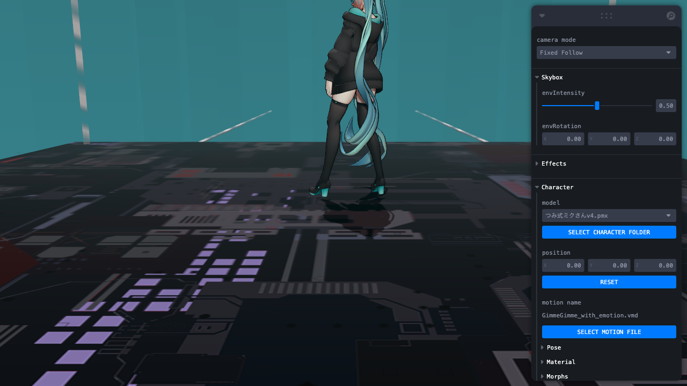

# Web-MMD

  
  <h2>
   <a href="https://culdo.github.io/web-mmd/">
   🚀 Try it now ! 🚀
   </a>
  </h2>

For who wants to play MMD in the browser, now you can play it in **real-time** anywhere.

This project is inspired by [the amazing three.js example](https://takahirox.github.io/three.js/examples/webgl_loader_mmd_audio.html) which by @takahirox.

# Features
* Play MMD with time control bar(time seeking, jump to time...etc)
* Game mode (can control character to walk and jump by keyboard)
* Change Model, Stage, Motion, Camera and Music
* Turn on/off auto camera(can play manually)
* Adjust shadow/outline/color/...etc
* Layout settings (Auto-hide gui/Show FPS/Fullscreen...etc)
* Presets (open/save-as/copy/export as `JSON` format)
* Camera Director mode (control camera by shortcuts in real-time)
* Camera Fixed-Follow mode (can adjust using mouse)
* Camera Editor mode (can edit on dope-sheet timeline)
* Keyboard Shortcuts(play/pause, toggle camera mode, manipulate camera cuts...)

# Keyboard and Mouse shortcuts
* Left click: Change camera angle
* Right click: Change camera panning

## Game mode
* **W/A/S/D**: Walk and move in the direction
* **Space**: Front flip jump
* Release all above keys: Idle
* **ESC**: Toggle game menu

## Player mode
* **Space**: Play/Pause
* **<** : Previous frame (under 30 fps) 
* **\>** : Next frame (under 30 fps)

## Camera Director mode
* **Tab**: Toggle All Trackings
* **1**: Toggle Angle Tracking
* **2**: Toggle Target Tracking
* **3**: Toggle Distance Tracking
* **4**: Toggle Up Tracking
* **Q,W,E,A,S,D,Z,X,C**: Move camera to one of 9 angles

# Transform Control
Move the objects by `transform control` in below ways: 
* Model: Directly click on it
* Light: Select one from `Lights > [Choose a light] > Select` gui menu

# Demo credits
## Player mode
The demo presets is from [this excellent MMD video](https://www.youtube.com/watch?v=ix9nEjSxgeo) :
* Music: GimmexGimme by 八王子P × Giga
* Model: つみ式みくさんv4 by つみだんご
* Motion: ぎみぎみ（みっちゃん）_原曲音源 by シガー
* Emotion: GimmeGimmeリップ表情v07 by ノン
* Camera: Gimme x Gimme镜头 by 冬菇
* Stage: RedialC_EpRoomDS by RedialC
## Game mode
* Motions: 移動モーション v1.3、ぼんやり待ちループ by むつごろう

# Development
1. Install deps via `npm install`
2. Run `npm run dev`
* Modules which mainly come from [the three.js example](https://takahirox.github.io/three.js/examples/webgl_loader_mmd_audio.html) is refactored to Classes and Async/Await styles.
* This projects is refactored to using `Next.js`(TypeScript).

## Tech stack
* `three.js` forked by @takahirox (For MMD)
* `postprocessing.js` (For effects)
  * HexDoF effect is ported from [Ray-MMD](https://github.com/ray-cast/ray-mmd) HLSL shaders
* `Next.js` (For framework and static site generation)
* `@react-three/*` (For r3f eco-system tools)
* `theatre.js` (For camera editor mode)
* `media-chrome` (For audio)
* `playwright` (For testing)

## E2E Testing using Playwright
Run `npm test`

## CI/CD
It uses `Github Action` to deploy the demo site. Related files are located at `./.github/workflows`.

# To-do list
## Done
- [x] play/pause
- [x] turn on/off shawdow
- [x] choose light color
- [x] player control bar
- [x] can choose different model, stage, motion, camera, music
- [x] Layout settings
- [x] Auto-save all gui settings in browser
- [x] Open/Save-As/Copy/Export MMD presets
- [x] SDEF rendering
  - [x] enable on PBR rendering
- [x] camera Fixed-Follow mode
- [x] PBR rendering
- [x] refactor to Typescript
- [x] refactor to @react-three eco-system
- [x] Skybox rendering
- [x] timeline editor
    - [x] camera composition mode
    - [x] camera editor mode (using Theatre.js)
- [x] Experimental WebGPU support
- [x] Efficient Hex DoF effect
- [x] In-APP Credits list
- [x] Allow multiple models
- [x] Multiple motions blending
- [x] Game mode
- [x] Introduction mode
- [x] Director mode

## WIP

## Planning 
- [ ] Camera movement templates
- [ ] Auto turn-off some effects on the first time for real-time performance
