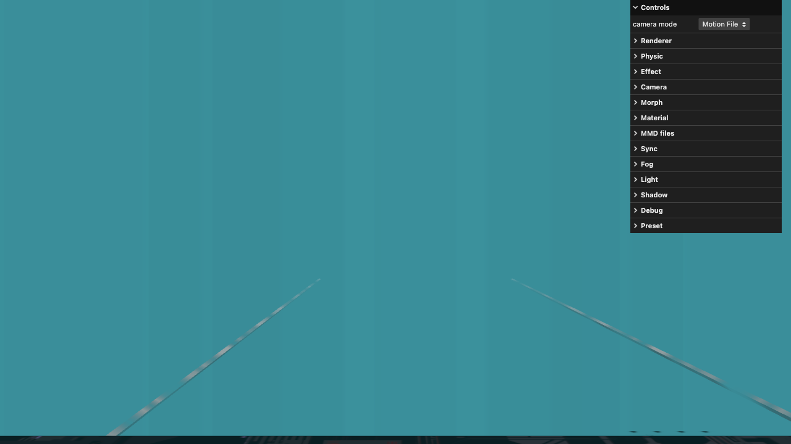

# Web-MMD

  

Try it now -> https://culdo.github.io/web-mmd/

For who wants to play MMD in the browser, you can now play it anywhere.

It is improved version of [three.js example](https://threejs.org/examples/#webgl_loader_mmd_audio).

# Features
* Play MMD with time control bar(time seeking, jump to time...etc)
* Change Model, Stage, Motion, Camera and Music(From YT or file)
* Turn on/off auto camera(can playing manually)
* Adjust shadow/outline/color/...etc
* Layout settings (Auto-hide gui/Show FPS/Fullscreen...etc)
* Presets (open/save-as/copy/export as `JSON` format)
* Camera Composition mode (create/del/next/prev camera cut)
* Camera Fix-Follow mode (can adjust using orbit controls)
* Keyboard Shortcuts(play/pause, toggle camera mode, manipulate camera cut...)

# Demo credits
* music: GimmexGimme by 八王子P × Giga
* model: つみ式みくさんv4 by つみだんご
* motion: ぎみぎみ（みっちゃん）_原曲音源 by シガー
* emotion: GimmeGimmeリップ表情v07 by ノン
* camera: Gimme x Gimme镜头 by 冬菇
* stage: RedialC_EpRoomDS by RedialC

# Development
Modules is refactored to Classes and Async/Await styles.

## Upgrade Ammo.js
1. `npm install github:kripken/ammo.js`: Install the latest version of Ammo.js  
2. `npm run copyAmmoJS`: Copy the latest `ammo.wasm.js` and `ammo.wasm.wasm` to `dist/`

## E2E Testing using Playwright
Run `npm test`

# To-do list
## Done
- [x] play/pause
- [x] turn on/off shawdow
- [x] choose light color
- [x] player control bar
- [x] can choose different model, stage, motion, camera, music
- [x] Layout settings
- [x] Auto-save all gui settings in browser
- [x] Open/Save-As/Copy/Export MMD presets
- [x] SDEF rendering
- [x] camera Fixed-Follow mode

## WIP
- [ ] PBR rendering
- [ ] timeline editor
    - [x] camera composition mode

## Planning
- [ ] refactor to Typescript
- [ ] In-APP Credits list
